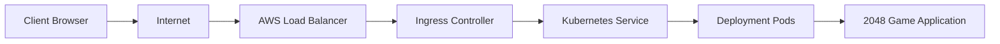

# Kubernetes Project: 2048 Game on AWS EKS

## Executive Summary for Recruiters

This repository presents a complete, hands-on Kubernetes project where a 2048 game web application was deployed on AWS EKS and exposed through Kubernetes networking and an AWS Load Balancer. It is designed to show real-world cloud-native skills in a format that is easy to understand during interviews, portfolio reviews, or technical discussions.

It also highlights experience with Kubernetes in two environments: local development with Minikube and cloud deployment with AWS. This combination demonstrates both hands-on local cluster experimentation and real cloud infrastructure usage.

In addition to the 2048 deployment, this repository also preserves the practical labs from a Kubernetes course, covering core concepts such as Pods, Deployments, Services, Ingress, ConfigMaps, Secrets, RBAC, Volumes, Resource Quotas, and Probes.

## 1. Project Overview

The main project demonstrates how a simple web application can be:

- containerized
- deployed to Kubernetes
- exposed through a Service
- published with Ingress
- made reachable through an AWS-managed Load Balancer

This is a strong example of DevOps, cloud, and container orchestration skills in action.

## 2. Why This Project Matters

This project is useful for recruiters because it shows practical experience with:

- cloud infrastructure
- container orchestration
- Kubernetes manifests
- networking in Kubernetes
- AWS integration
- deployment validation and troubleshooting

## 3. Technologies Used

- Kubernetes
- Minikube for local cluster testing
- AWS EKS for cloud deployment
- kubectl
- Docker
- Nginx / static web server
- Ingress Controller
- AWS Load Balancer / ELB integration
- YAML manifests for Deployments, Services, Ingress, ConfigMaps, Secrets, and RBAC

## 4. AWS EKS Cluster Information

The application was deployed on an AWS EKS cluster using the following flow:

1. Create an EKS cluster in AWS.
2. Configure kubectl to connect to the cluster.
3. Deploy the application using Kubernetes manifests.
4. Expose the app through Service and Ingress.
5. Validate access via the AWS Load Balancer.

## 5. Kubernetes Deployment Steps

### Connect to the cluster

```bash
aws eks update-kubeconfig --name <cluster-name> --region <region>
```

### Apply the deployment

```bash
kubectl apply -f deployment/dep.yaml
```

### Expose the app with a Service

```bash
kubectl apply -f service/svc.yaml
```

### Configure Ingress

```bash
kubectl apply -f ingress/ingress.yaml
```

### Verify the resources

```bash
kubectl get pods
kubectl get svc
kubectl get deployments
kubectl get ingress
kubectl describe ingress <ingress-name>
```

## 6. Services and Ingress Configuration

The deployment uses Kubernetes objects to expose the application:

- Deployment: runs the 2048 application containers
- Service: provides stable internal networking for the pods
- Ingress: routes external traffic and integrates with the AWS load balancer

This demonstrates how a web app can be made publicly reachable through Kubernetes networking resources.

## 7. AWS Load Balancer Integration

The Ingress controller provisions an AWS Load Balancer for the application. Traffic reaches the load balancer first, then forwards to the Kubernetes Service and the application pods.

This is a practical example of cloud-native exposure in a production-like environment.

## 8. Architecture Diagram



## 9. Kubernetes Course Concepts Covered

This repository is not only a deployment example; it also reflects a full Kubernetes hands-on course. The following topics are included in the repo structure:

- Pods and containers
- Deployments and ReplicaSets
- Services and Service discovery
- ConfigMaps and environment variables
- Secrets
- Namespaces and environment separation
- Resource requests and limits
- Resource Quotas and LimitRanges
- Health probes and readiness/liveness checks
- RBAC and service accounts
- Volumes and Persistent Volumes
- Ingress and external access

This combination makes the repository a strong portfolio example for both beginner and intermediate cloud-native roles.

## 10. Validation Steps and Screenshots

The deployment was validated by checking cluster state, pod status, service exposure, and public access through the AWS load balancer.

### Validation commands

```bash
kubectl get nodes
kubectl get pods -A
kubectl get svc
kubectl get ingress
kubectl describe svc <service-name>
```

### Screenshots

- Cluster and resources overview: [aws-eks-2048-deployment/screenshots/kubectl-get-nodes-and-get-all.png](aws-eks-2048-deployment/screenshots/kubectl-get-nodes-and-get-all.png)
- Application running: [aws-eks-2048-deployment/screenshots/game2048-running.png](aws-eks-2048-deployment/screenshots/game2048-running.png)
- AWS Load Balancer: [aws-eks-2048-deployment/screenshots/load-balancer.png](aws-eks-2048-deployment/screenshots/load-balancer.png)
- EKS cluster status: [aws-eks-2048-deployment/screenshots/eks-cluster-active.png](aws-eks-2048-deployment/screenshots/eks-cluster-active.png)
- Project preview image: [aws-eks-2048-deployment/screenshots/video-website-game.jpeg](aws-eks-2048-deployment/screenshots/video-website-game.jpeg)

## 11. Commands Used

```bash
aws eks update-kubeconfig --name <cluster-name> --region <region>
kubectl apply -f deployment/dep.yaml
kubectl apply -f service/svc.yaml
kubectl apply -f ingress/ingress.yaml
kubectl get pods
kubectl get svc
kubectl get deployments
kubectl get ingress
```

## 12. Skills Demonstrated

This project highlights the following recruiter-friendly skills:

- Containerization and application deployment
- Kubernetes manifest authoring
- Local cluster experience with Minikube
- EKS cluster configuration and management on AWS
- Service discovery and internal networking
- Ingress and external traffic routing
- AWS Load Balancer integration
- Cloud-native application exposure
- Troubleshooting and validation in Kubernetes
- Hands-on understanding of core Kubernetes concepts from a structured course

## 13. Final Note

This repository is a practical example of deploying a small web application in a modern Kubernetes environment. It is especially useful for demonstrating real-world DevOps, Cloud, and Platform Engineering skills during interviews and portfolio presentations.
